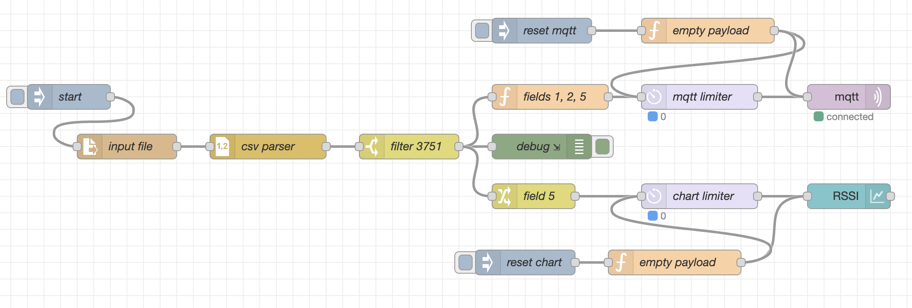
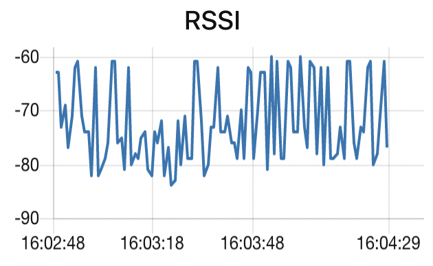

# Home challenge #2

## Brief description of the flow

1. `input file`, `csv parser` and `filter 3751`: Import the input `.csv` file and extract the entry containing the last four digits of my person code plus the 99 following entries;
2. `fields 1, 2, 5`, `mqtt limiter` and `mqtt`: create a valid MQTT payload containing the requested fields and send them to the Thingspeak channel while limiting the number of messages sent to 2 msg/minute;
3. `field 5`, `chart limiter` and `RSSI`: extract `field5` from the payload and plot it.

The remaining blocks are respectively:

* `start`: to manually start the execution flow;
* `debug`: to print on the Node Red console information about the execution flow at runtime;
* `reset`: the reset blocks are used to make it easier to debug the flow by cleaning the input that gets sent to the plotting block and to the MQTT block.

This is the chart that is plotted by the `RSSI` chart block:

