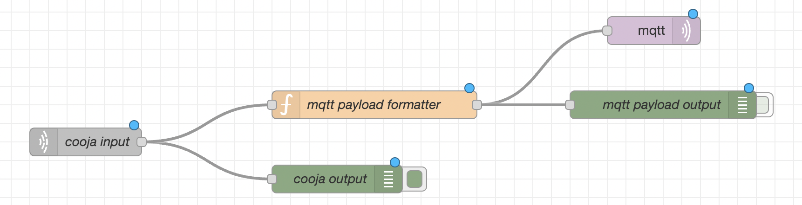

## Notes and assumptions

The TinyOS function [`Leds.get()`](https://github.com/tinyos/tinyos-main/blob/master/tos/interfaces/Leds.nc#L117) does not return the expected state of the LEDs. It returns always 7. For this reason the LED state in the `Ch3C.nc ` file is represented as an integer constant and set manually each time the timer executes.

This is the url of the Thinspeak channel used: https://thingspeak.com/channels/1724994/. It's ID is 1724994.

## Brief description of the flow

* `cooja input`: socket which receives streams of bytes from Cooja server as strings separated by the newline character;
* `mqtt payload formatter`: node that reads incoming strings and parses as dictionaries the ones which does not contain debug output. Then it creates a valid MQTT payload to be sent via the mqtt node.

The other nodes are debug prints which are used to check that everything is working as expected.

