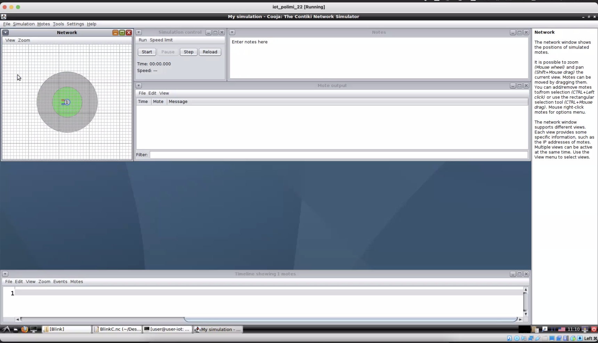
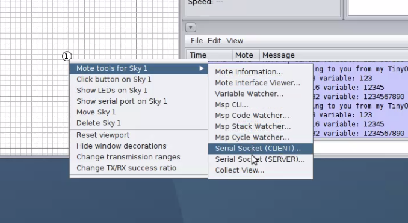
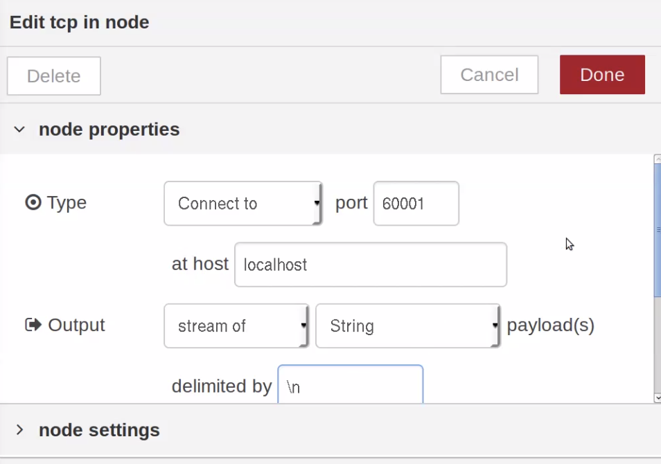
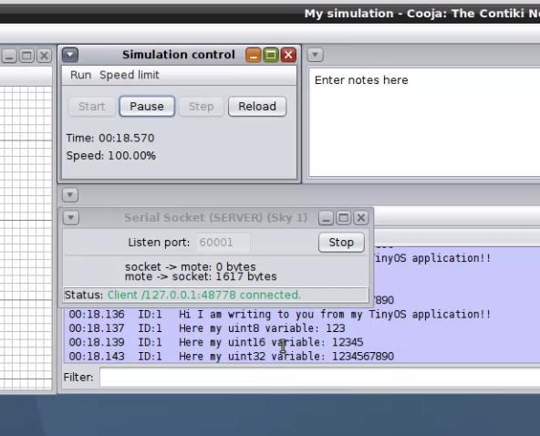
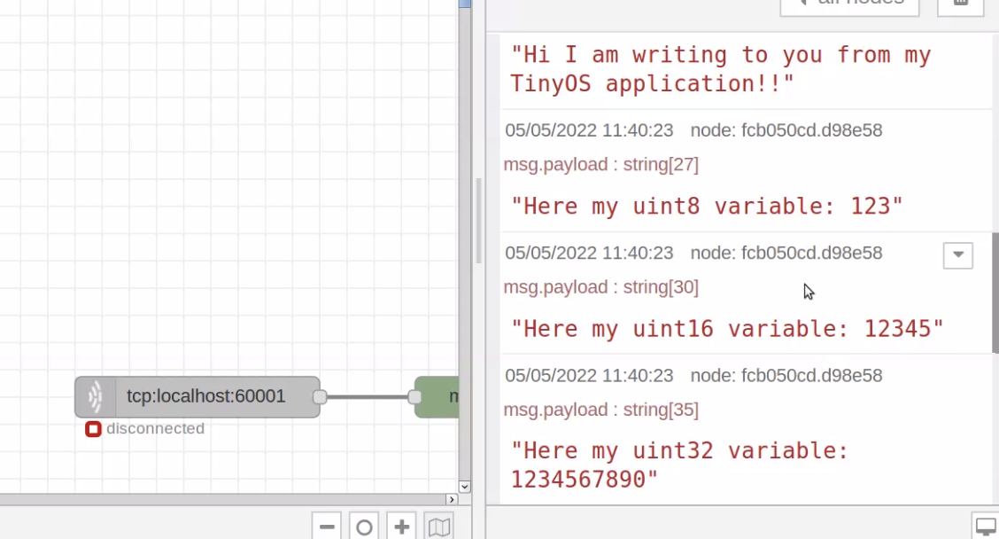

# IoT CH3 Notes

## TinyOs

Blink lights example

* `BlinkC`: logic of the app
* `BlinkAppC`: declaration of libraries

### `BlinkC`

#### Libraries

`Timer.h` is the only library we'll use in this application.

#### Interface declaration

```c
module BlinkC @safe()
{
  uses interface Timer<TMilli> as Timer0;
  uses interface Timer<TMilli> as Timer1;
  uses interface Timer<TMilli> as Timer2;
  uses interface Leds;
  uses interface Boot;
}
```

We'll need three timers with different timing, we declare and rename them. We'll also need the `led` interface; the `boot` interface is always used since it's used to boot the system.

#### Application logic

```c
implementation
{
  // boot: we start discrete timers
  event void Boot.booted()
  {
    // startPeriodic(n) = every n ms starts the timer
    call Timer0.startPeriodic( 250 );
    call Timer1.startPeriodic( 500 );
    call Timer2.startPeriodic( 1000 );
  }

  // func triggered when Timer0 executes
  event void Timer0.fired()
  {
    // every 250ms the led goes of it its on and vice versa
    dbg("BlinkC", "Timer 0 fired @ %s.\n", sim_time_string());
    call Leds.led0Toggle();
  }
  
  event void Timer1.fired()
  {
    dbg("BlinkC", "Timer 1 fired @ %s \n", sim_time_string());
    call Leds.led1Toggle();
  }
  
  event void Timer2.fired()
  {
    dbg("BlinkC", "Timer 2 fired @ %s.\n", sim_time_string());
    call Leds.led2Toggle();
  }
}
```

Events happen when something triggers them, they do not happen in order of declaration.

### `BlinkAppC`

Needed to make the app work. 

```c
configuration BlinkAppC
{
}
implementation
{
  components MainC, BlinkC, LedsC;
  components new TimerMilliC() as Timer0;
  components new TimerMilliC() as Timer1;
  components new TimerMilliC() as Timer2;

	// Once components are declared we have to
  // wire them to the components of the other file:
  
  BlinkC -> MainC.Boot;

  BlinkC.Timer0 -> Timer0;
  BlinkC.Timer1 -> Timer1;
  BlinkC.Timer2 -> Timer2;
  BlinkC.Leds -> LedsC;
}
```

* `configuration` is not needed for small apps
* `MainC` is always present, like the C `main`
* `BlinkC` is the file we already saw
* `Leds`, `Timer` declaration like in `BlinkC`. In this file we can also give different names to timers

### How to run tinyos code + Cooja

```bash
$ cd $APP_FOLDER
$ make $SENSOR_NAME sim
```

* `APP_FOLDER`: app 
* `SENSOR_NAME`: name of the hw sensor for which we're building the app

A `build` folder containing an executable will be created with the `make` command. When can then execute that file using Cooja (Contiki simulator):



1. file-> new simulation
2. motes->add motes->create new mote type-> sky mote
3. browsw -> apps->blink->build->telosb-> main.exe file
4. View -> LEDs

### Another app: `printf`

* `TestPrintfC.nc`

  ```c
  #include "printf.h"
  module TestPrintfC {
    uses {
      interface Boot;
      interface Timer<TMilli>;
    }
  }
  implementation {
  	
    // integer size needs to be specified
    uint8_t dummyVar1 = 123;
    uint16_t dummyVar2 = 12345;
    uint32_t dummyVar3 = 1234567890;
  
    event void Boot.booted() {
      call Timer.startPeriodic(1000);	
    }
  
    event void Timer.fired() {
    	printf("Hi I am writing to you from my TinyOS application!!\n");
    	printf("Here is a uint8: %u\n", dummyVar1);
    	printf("Here is a uint16: %u\n", dummyVar2);
    	printf("Here is a uint32: %ld\n", dummyVar3);
      // stdout buffer needs to be flushed
      // after a batch of prints
    	printfflush();
    }
  }
  ```

* `TestPrintfAppC.nc`

  ```c
  #define NEW_PRINTF_SEMANTICS
  #include "printf.h"
  
  configuration TestPrintfAppC{
  }
  implementation {
    components MainC, TestPrintfC;
    components new TimerMilliC();
    components PrintfC;
    components SerialStartC;
  
    // wiring components
    TestPrintfC.Boot -> MainC;
    TestPrintfC.Timer -> TimerMilliC;
  }
  ```

  To simulate this, open Cooja, new simulation, skymote, etc. Before doing that you want to compile with `$ make telosb`.

## Node Red + Cooja

Run `$ node-red`, go to `localhost:8080`. Now in Cooja:



Select `Serial Socket SERVER`, go back to node red and create a new `TCP Node` which will be used to capture the stream sent by Cooja. Setup the node like the following:



We connect to the socket and we start the Cooja simulation:

* Cooja:

  

* Node red:

  

## Notes

* To run the Cooja simulation at real time you need to set the speed limit to 100%;
* If something's wrong, just look at the slides for a corrected version of the code

## The challenge

Goal: collect data with the mote and sends it via MQTT to Thingspeak.