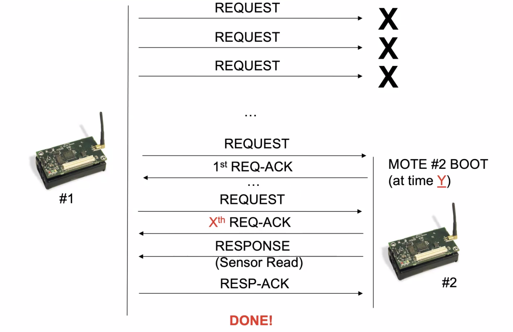

# Challenge 4

## Notes on how to build a tinyOS apps which exchanges packets

### Introduction

We have to take into consideration basically everything.

Idea: The sender has to create the message and fill it with the desired data (in our case `type`, `counter`, `value` for example), then specify the destination (either `BROADCAST` or `UNICAST`, in the latter we have to specify the address). To send the message to the OS we'll use TinyOS functions.

### File structure

We'll use as example `tinyos/apps/RadioCountToLeds`.

#### Header file `RadioCountToLeds.h`

```c
#ifndef RADIO_COUNT_TO_LEDS_H
#define RADIO_COUNT_TO_LEDS_H

// structure
typedef nx_struct radio_count_msg {
  // nx used to resolved endianness problem
  // we do not care about ut
  nx_uint16_t counter;
} radio_count_msg_t;

// needed to use the radio
enum {
  AM_RADIO_COUNT_MSG = 6,
};

#endif
```

#### App Component Declaration `RadioCountToLedsAppC.nc`

```c
configuration RadioCountToLedsAppC {}

implementation {
  // main, app name, leds
  components MainC, RadioCountToLedsC as App, LedsC;
  // used to send, receive messages
  components new AMSenderC(AM_RADIO_COUNT_MSG);
  components new AMReceiverC(AM_RADIO_COUNT_MSG);
  //used to turn on/off the radio
  components ActiveMessageC;
  
  components new TimerMilliC();
  
  // wiring
  App.Boot -> MainC.Boot;
  App.Receive -> AMReceiverC;
  App.AMSend -> AMSenderC;
  App.AMControl -> ActiveMessageC;
  App.Leds -> LedsC;
  App.MilliTimer -> TimerMilliC;
  // packet management (field extraction, etc.)
  App.Packet -> AMSenderC;
}
```

#### App Logic `RadioCountToLedsC.nc`

Module declaration:

```c
module RadioCountToLedsC @safe() {
  uses {
    interface Leds;
    interface Boot;
    interface Receive;
    interface AMSend;
    interface Timer<TMilli> as MilliTimer;
    interface SplitControl as AMControl;
    interface Packet;
  }
}
```

##### `implementation`

```c
// TinyOS 2.x message buffer abstraction,
  // used to send AM packets.
  message_t packet;

  bool locked;
  uint16_t counter = 0;
  
  // when we boot we start the radio
  event void Boot.booted() {
    call AMControl.start();
  }

  // after starting the radio we start the timer
  event void AMControl.startDone(error_t err) {
    if (err == SUCCESS) {
      call MilliTimer.startPeriodic(250);
    }
    else {
      call AMControl.start();
    }
  }
```

The following function is needed otherwise it will throw an error:

```c
event void AMControl.stopDone(error_t err) {
    // do nothing
  }
```

Let's see what happens when `call MilliTimer.startPeriodic(250);` is called:

```c
event void MilliTimer.fired() {
    counter++;
    dbg("RadioCountToLedsC", "RadioCountToLedsC: timer fired, counter is %hu.\n", counter);
    if (locked) {
      return;
    }
    else {
      // type of tinyos (?) I do not think so, we just defined it
      radio_count_msg_t* rcm =
        (radio_count_msg_t*)call Packet.getPayload(&packet, sizeof(radio_count_msg_t));
      if (rcm == NULL) {
	      return;
      }

			// if the rcm is okay we can send it
      rcm->counter = counter;
      // broadcast address
      if (call AMSend.send(AM_BROADCAST_ADDR, &packet, sizeof(radio_count_msg_t)) == SUCCESS) {
	      dbg("RadioCountToLedsC", "RadioCountToLedsC: packet sent.\n", counter);	
	      locked = TRUE;
      }
    }
  }
```

Rest of the file:

```c
// when receiving the message we do the bitmask, we check if
  // first, second and third bits, check if they are 0/1 and turn
  // on/off leds accordingly
  event message_t* Receive.receive(message_t* bufPtr, void* payload, uint8_t len) {
    dbg("RadioCountToLedsC", "Received packet of length %hhu.\n", len);
    // check that pkt length is same as the message length
    if (len != sizeof(radio_count_msg_t)) {return bufPtr;}
    else {
      // bitmask op: counter value in bits & values listed below
      // 1 = 0x001
      // 2 = 0x010
      // 3 = 0x100
      radio_count_msg_t* rcm = (radio_count_msg_t*)payload;
      if (rcm->counter & 0x1) {
	      call Leds.led0On();
      }
      else {
	      call Leds.led0Off();
      }
      if (rcm->counter & 0x2) {
	      call Leds.led1On();
      }
      else {
	      call Leds.led1Off();
      }
      if (rcm->counter & 0x4) {
	      call Leds.led2On();
      }
      else {
	      call Leds.led2Off();
      }
      return bufPtr;
    }
  }

  // understands when radio is empty (message sent)
  // and we can unlock the radio
  event void AMSend.sendDone(message_t* bufPtr, error_t error) {
    if (&packet == bufPtr) {
      locked = FALSE;
    }
  }
```

#### `topology.txt`

```
1 2 -60.0
2 1 -60.0
```

Line 1 = mote #1 can communicate with mote #2, line 2 = vice versa. -60 is the channel gain.

#### `RunSimulationScript.py`

We can either output the simulation to `stdout` or to a file.

```python
simulation_outfile = "tossim.log"
print "Saving sensors simulation output to:", simulation_outfile
out = open(simulation_outfile, "w");
#out = sys.stdout;
```

We can have different debug channels:

```python
#Add debug channel
print "Activate debug message on channel init"
t.addChannel("init",out);
print "Activate debug message on channel boot"
t.addChannel("boot",out);
print "Activate debug message on channel radio"
t.addChannel("radio",out);
print "Activate debug message on channel radio_send"
t.addChannel("radio_send",out);
print "Activate debug message on channel radio_ack"
t.addChannel("radio_ack",out);
print "Activate debug message on channel radio_rec"
t.addChannel("radio_rec",out);
print "Activate debug message on channel radio_pack"
t.addChannel("radio_pack",out);
print "Activate debug message on channel role"
t.addChannel("role",out);
print "Activate debug message on channel CH4App"
t.addChannel("CH4App",out);
```

Here we define how many events should run:

```python
for i in range(0,1200):
	t.runNextEvent()
```

## The challenge itself

Challenge structure:

* Develop TinyOS app
* Simulate it with TOSSIM

`.zip` content:

* TinyOS code
* Python code
* Topology
* Noise
* Execution logs from terminal
* Short report
* Repository link

## What do we do?

We'll have two motes, the first one sends requests while the second one sends responses. The first asks for a value and the second one answers with that value, which is a random number generated with a random library:



## Message format

| Mote #1  | Mote #2                     |
| -------- | --------------------------- |
| REQ type | RESP type                   |
| Counter  | Counter sent by mote #1     |
|          | Value read from fake sensor |

The request has periodicity 1000ms.

## Rules

1. Each message (REQ/RESP) must be acknowledged using the built-in ACK module.
2. Upon receipt of the Xth REQ-ACK message:
   1. Mote #1 stops to send requests
   2. The exercise is done
3. Use the  module `PacketAcknowledgements` to  send the  ACKs.

### Parameters

* X = [last digit of person code] + 1
* Y = person code without last three digits and first three digits.

## Notes

* There's a draft on the VM and also on Webeep which we can use to write the code for the challenge: `SendACK_template/sendAckC.nc`.

* TOSSIM and Node-Red cannot interact right now, so we'll not use Node-Red for this challenge.

* The simulation with TOSSIM:

  * Mote #1 at time 0
  * Mote #2 after Y seconds

* Only one message type containing:

  * `msg_type`: REQ/RESP
  * `msg_counter`: incremental integer
  * `value`: value from the fake sensor


### Running the code

To compile the mote’s code:

```shell
$ make micaz sim
```

To run the simulation:

```shell
$ python RunSimulationScript.py
```

### Some notes if you're on M1

Suppose you got a arm64 vm running locally in UTM and another remote machine which is executing the `.ova` virtual machine given by the prof, you could do the following:

1. `sshfs` to mount the x86 vm (running on a remote x86 device) in the (locally executing on UTM) arm64 vm
2. Open vscode on macOS, use `ssh` to open the arm64 folder in which the x86 filesystem is mounted to edit the source code
3. To compile, run `make micaz` in a local terminal of the x86 vm. To do this you can directly `ssh` into the remote x86 vm

Unfortunately we cannot use the vscode ssh remote extension directly into the x86 vm because of the different architecture between the Mac and the vm. [It's a known limitation of the extension](https://github.com/microsoft/vscode-remote-release/issues/1529).

